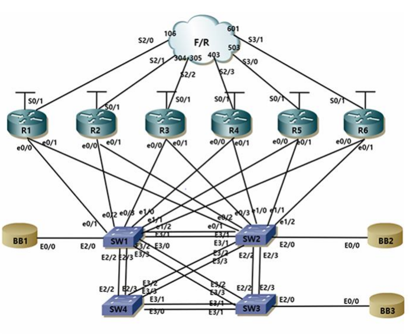

# Cisco L2 Switching Project

개인 실습으로 네트워크 구성 전반(스위칭, 라우팅, 보안 설정)을 먼저 진행했고, 이후 4인 팀 프로젝트에서는 Bridging and Switching(VTP, Trunk, EtherChannel, MST, VLAN) 파트를 담당했습니다.

---

## 담당 범위

- VTP(VLAN Trunking Protocol) 서버/클라이언트 구성
- Trunk Port 및 허용 VLAN 제한
- EtherChannel 구성 및 로드밸런싱
- MST(Multiple Spanning Tree) 인스턴스 분리 및 루트 지정
- VLAN 생성 및 인터페이스 할당
- UDLD, MAC Address Table Aging Time

---

## Config Files

| 스위치 | 역할 |
|---|---|
| [SW1.cfg](configs/SW1.cfg) | VTP Server, MST Instance 1 Root |
| [SW2.cfg](configs/SW2.cfg) | VTP Client, MST Instance 3 Root, R6 Trunk |
| [SW3.cfg](configs/SW3.cfg) | VTP Client, UDLD |
| [SW4.cfg](configs/SW4.cfg) | VTP Client, MST Instance 2 Root, UDLD |

---

## 검증 결과

### VTP 도메인 전파 확인 (SW1)

    VTP Domain Name          : history.com
    VTP Operating Mode       : Server
    Number of existing VLANs : 14

### VLAN 할당 확인 (SW1)

    VLAN  Name                        Status    Ports
    1     default                     active    Fa0/1, Fa1/0, Fa1/1, Fa1/3
    11    BB1                         active    Et0/0, Et2/0
    21    VLAN_A                      active
    22    VLAN_B                      active    Et0/2
    100   VLAN_SWITCHES               active

### EtherChannel 그룹 확인 (SW1)

    Group  Port-channel  Protocol  Ports
    ------+-------------+---------+-------------------
    12     Po12(SU)      -         Et3/0(P) Et3/1(P)
    13     Po13(SU)      -         Et3/2(P) Et3/3(P)

### MST 인스턴스 및 루트 확인 (SW1)

    Name      [HISTORY]
    Revision  1    Instances configured 4
    Instance  Vlans mapped
    0         1-10,13-20,22-99,101-4094
    1         11,21
    2         100
    3         12

`SW1#show spanning-tree vlan 11` — MST1 Root ID가 SW1 자신의 Bridge ID와 일치, "This bridge is the root" 확인

### MAC Address Table Aging Time 확인 (SW3)

    Global Aging Time: 300
    Vlan   Aging Time
    ----   ----------
    13     500

### SVI(VLAN 100) 인터페이스 정상 동작 확인 (SW1)

    Interface   IP-Address    OK? Method Status  Protocol
    Vlan100     14.14.90.1    YES manual up      up

---

## 발표 자료

[전체 워크북 실습 자료 보기](cisco-l2-switching-project.pdf)

> 위 자료는 4인 팀이 함께 진행한 워크북 전체 실습 내용을 담고 있습니다. 본인이 실제로 담당한 범위는 위 "담당 범위" 및 config 파일 기준으로 확인하실 수 있습니다.
